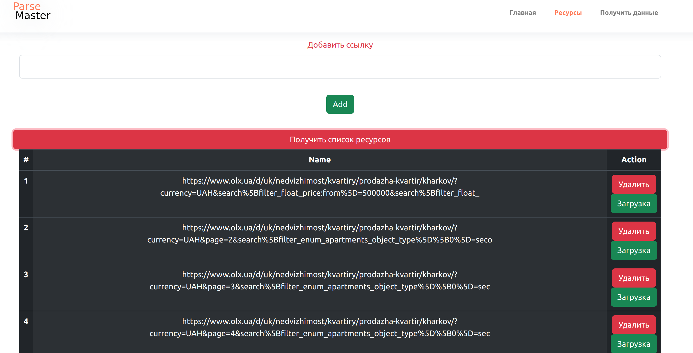
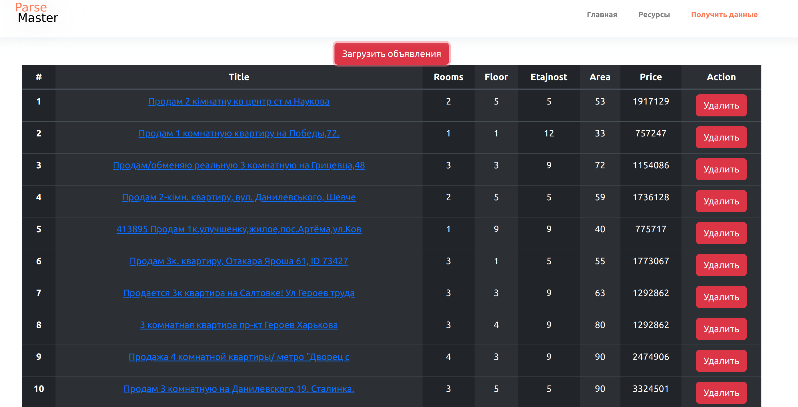

# Сайт для считывания данных с последующем сохранением в JSON.

База данных: MongoDB

Создаем файл .env

    DATA_URI = "mongodb+srv://наш адресс" 

Сборщик: Gulp

Создаем список страниц, которые планируем парсить.

Для запуска выбираем нужную страницу и нажимаем "Загрузка"

Во время загрузки кнопки повторного запуска блокируются и через 30-40 секунд
появится сообщение с информацией об окончании.

Можно просмотреть и отредактировать полученный список. Все результаты 
сохраняются в базу данных.

В конце страницы предусмотренна возможность сохранения результатов 
локально в формате JSON, для возможности обработки их в любой специализированной программе.

Это небольшой пример работы. Для индивидуальных желаний и более серьезных
проектов пишите на go280286sai@gmail.com